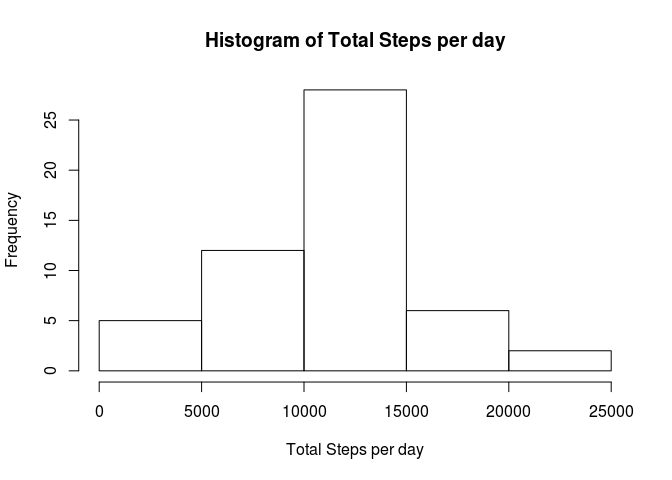

# Reproducible Research: Peer Assessment 1
## Load libraries

```r
library(knitr)
library(dplyr)
```
## set global options

```r
opts_chunk$set(echo = TRUE)
```

## Loading and preprocessing the data

```r
activity <- read.csv(unz("activity.zip", "activity.csv"), head = TRUE)
```

## What is mean total number of steps taken per day?

```r
steps_per_day <- summarize(group_by(activity, date), sum(steps))
names(steps_per_day)[2]= "steps"
hist(steps_per_day$steps, xlab = "Total Steps per day", main = "Histogram of Total Steps per day")
```



```r
step_mean <- mean(steps_per_day$steps, na.rm = TRUE)
step_median <- median(steps_per_day$steps, na.rm=TRUE)
```
Calculation of total number of steps taken per day:  
mean: 1.0766189\times 10^{4}  
median: 10765

## What is the average daily activity pattern?


## Imputing missing values


## Are there differences in activity patterns between weekdays and weekends?
