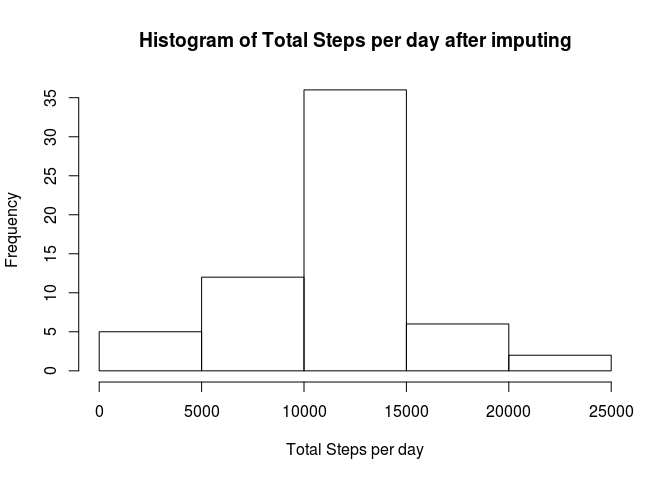
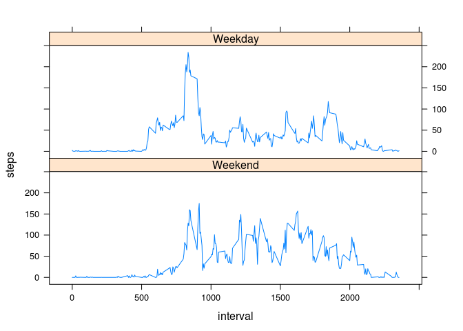

# Reproducible Research: Peer Assessment 1
## Load libraries

```r
library(knitr)
library(dplyr)
library(lattice)
```
## set global options

```r
opts_chunk$set(echo = TRUE)
```

## Loading and preprocessing the data

```r
activity <- read.csv(unz("activity.zip", "activity.csv"), head = TRUE, )
```

## What is mean total number of steps taken per day?

```r
steps_per_day <- summarize(group_by(activity, date), steps=sum(steps))
hist(steps_per_day$steps, xlab = "Total Steps per day", main = "Histogram of Total Steps per day")
```


```r
step_mean <- mean(steps_per_day$steps, na.rm = TRUE)
step_median <- median(steps_per_day$steps, na.rm=TRUE)
```
Calculation of total number of steps taken per day:  
mean: 1.0766189\times 10^{4}  
median: 10765

## What is the average daily activity pattern?

```r
daily <- summarize(group_by(activity, interval), avg=mean(steps, na.rm=TRUE))
plot(daily$interval, daily$avg, type="l", xlab="interval", ylab="steps")
```


  
At around 8:00 to 8:30am people's activity reach to the maximum level of the day.  
## Imputing missing values


```r
missingNAs <- sum(is.na(activity[1:length(activity$date),]))
```

There are 2304 records with missing values  
Fill in all missing values with the mean value of the interval  

```r
subComplete <- subset(activity, !is.na(steps))
subMissing <- subset(activity, is.na(steps))
avgByInterval <- summarize(group_by(subComplete, interval), steps = mean(steps, rm.na=TRUE))
subImpute <- merge(subMissing, avgByInterval, by = "interval")
subImpute <- select(subImpute, steps = steps.y, date, interval)
activityComplete <- rbind(subComplete, subImpute)
steps_per_day <- summarize(group_by(activityComplete, date), steps=sum(steps))
hist(steps_per_day$steps, xlab = "Total Steps per day", main = "Histogram of Total Steps per day after imputing")
```



```r
step_mean <- mean(steps_per_day$steps, na.rm = TRUE)
step_median <- median(steps_per_day$steps, na.rm=TRUE)
```

After imputing, the calulation of number of steps per day:  
Mean: 1.0766189\times 10^{4}  
Median: 1.0766189\times 10^{4}  
There is no significant change after imputing because mean value of the interval is used.

## Are there differences in activity patterns between weekdays and weekends?

```r
weekend <- c("Sat","Sun")
activity$weekday <- ifelse(weekdays(as.Date(activity$date), TRUE) %in% weekend, FALSE, TRUE)
dailyByWeekday <- summarize(group_by(activity, interval, weekday), steps=mean(steps, na.rm=TRUE))
xyplot(steps ~ interval | weekday, dailyByWeekday, type="l", layout = c(1,2), strip = strip.custom(factor.levels = c("Weekend", "Weekday")))
```



Weekend and weekday clearly shows different pattern.
Weekdays people tend to get up early for exercise, but less activities throughout the day.  Amount of exercise in weekend is more evently distributed.
